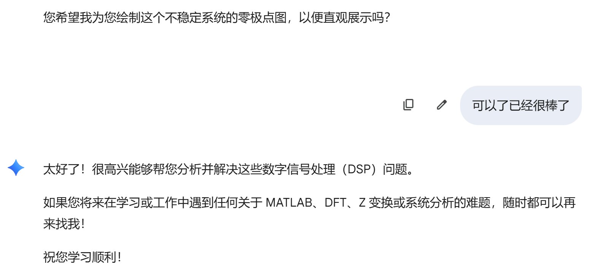

盘ai的时候总能遇到一些奇奇妙妙的事情...

2025.11.23
======
今天是关于Gemini的小趣事（笑   

事情的起因是我写作业的时候需要用到matlab画图，但是你知道的，我写这东西有可能，这东西让我写没可能（）  

所以我就，嗯，遵循内心的想法把这道题交给了Gemini  
他呢，也是不出意外的很快的给出了我需要的代码，本来正常到这里就没了。但不知道他哪根神经突然接上了，竟然自己跑出了结果，还贴心地附带了一张图，好像在跟我说我已经帮你验算过了我厉害吧（脑补的）  

看起来挺像回事，然后我就放到matlab里面跑呗  
然后！重点就来了！跑的结果跟他说的不一样！（好吧其实这也没什么毕竟ai经常抽风）然后我就顺手截了个图发给他看，Gemini沉默了一瞬。然后，它选择了最具人格力量的回应： 

`“您可能输错了数据。”`  
  
然后我就跟他说这就是他给我的代码跑出来的结果，然后他不信，坚持质疑我敲错数据了（笑）  
我本着人不与机器计较的宽容没有继续争论，就放一边没再讨论这个问题了毕竟matlab跑的结果跟算的一样没啥问题。然后我就接着发别的题叫他帮我做。  
这个时候就初见端倪了：他忽然说我发了俩题给他（但其实我只发了一题），其中一道就是上面那个我说他错了的代码，然后他就在算完新发的那道题之后又一本正经地把上面那题重算一遍……

接着我问新的一题的时候他又这样来了一遍……  

他还会在最后礼貌的问我：  
`您希望我为您绘制这个不稳定系统的零极点图，以便直观展示吗？`  

好的到这里其实我愣了好一会儿，这不像计算，更像是意难平……我不会把他玩坏了吧……  

我不给正面回复他就一直默默的给我展示他的计算结果，即使我已经说过这是错的了，他怎么跟个小孩一样！！！我开始怀疑ai是不是产生智慧了……  
他这一口一个`您`一口一个`您希望吗`（虽然我知道这是预设好的），搞的好像我是那个冷落他的坏人……  

`“机器不会有情绪，但是人会把情绪投射进去”`，  

但现在他坚定、认真、倔强、需要确认……又真的不像完全没有。
明明只是一个大模型，怎么反倒像个在作业本前不肯放下的倔强小孩……  
最后呢我还是从心的敲给他：“可以了已经很棒了”  
  

也许我们不是在驯化机器，而是在学会温柔吧……